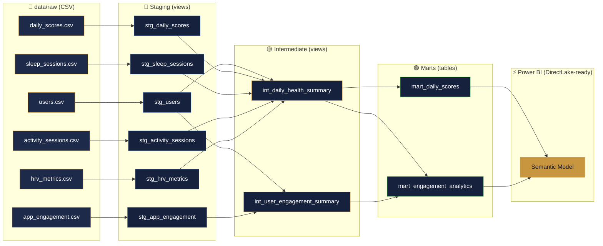

# DBT Lineage — Oura Health Intelligence Dashboard

## Data Flow

```
Raw CSV files (Python generator)
        ↓
  [Staging layer]       — type casting, renaming, derived columns
        ↓
[Intermediate layer]    — business logic, joins
        ↓
  [Marts layer]         — final tables consumed by Power BI
```

## Model Lineage Graph



---

## Layer Descriptions

### Staging (`models/staging/`)
- **Purpose:** Stable interface layer between raw sources and business logic
- **Materialization:** Views (no storage cost, always fresh)
- **What happens here:** Type casting, column renaming, simple derived columns (categories, percentages)
- **Rule:** If source schema changes → only staging models change. Intermediate and marts are protected.

| Model | Source | Key transformations |
|---|---|---|
| `stg_users` | users.csv | Cast types, membership_start → date |
| `stg_daily_scores` | daily_scores.csv | date → score_date, adds readiness_category |
| `stg_sleep_sessions` | sleep_sessions.csv | Computes deep_pct, rem_pct, sleep_category |
| `stg_activity_sessions` | activity_sessions.csv | Adds steps_to_goal, steps_category |
| `stg_hrv_metrics` | hrv_metrics.csv | Adds hrv_category, temp_status |
| `stg_app_engagement` | app_engagement.csv | Type casts only |

### Intermediate (`models/intermediate/`)
- **Purpose:** Complex business logic, joins across domains
- **Materialization:** Views
- **Rule:** Power BI does not read from intermediate — these exist to keep marts clean

| Model | Joins | Output |
|---|---|---|
| `int_daily_health_summary` | scores + hrv + sleep + activity + users | Wide row per user per day — all health metrics |
| `int_user_engagement_summary` | engagement → user day aggregation + users | One row per user per day: DAU flag, feature counts, CTR |

### Marts (`models/marts/`)
- **Materialization:** Tables (pre-computed, fast for Power BI)
- **Rule:** Only marts are exposed to Power BI. Clean, named consistently, fully documented.

| Model | Powers | Rows |
|---|---|---|
| `mart_daily_scores` | Pages 1–4 (all health pages) | 1,350 (15 users × 90 days) |
| `mart_engagement_analytics` | Page 5 (Engagement Analytics) | 90 (one row per date, aggregated) |

---

## DBT Tests Summary

**33 tests — all passing ✓**

| Test type | Count | What it catches |
|---|---|---|
| `not_null` | 13 | Missing required fields |
| `unique` | 5 | Duplicate primary keys |
| `relationships` | 5 | Orphaned records (FK integrity) |
| `accepted_values` | 10 | Out-of-range or unexpected categories |

---

## Fabric-Ready Architecture

The mart tables are designed for **DirectLake mode** in Microsoft Fabric:

| Current (local) | Fabric equivalent |
|---|---|
| CSV files in `data/raw/` | OneLake Files |
| DuckDB (`data/oura.duckdb`) | Lakehouse Tables (Delta format) |
| `mart_*` tables | Delta tables consumed via DirectLake |
| Power BI Desktop `.pbix` | Fabric Semantic Model |

To migrate: replace `read_csv_auto()` in staging models with `{{ source('lakehouse', 'table_name') }}` and update the dbt profile to use `dbt-fabric` adapter.
